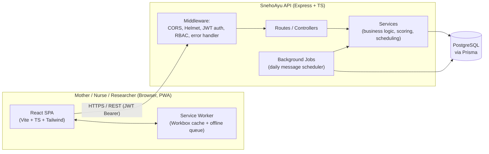
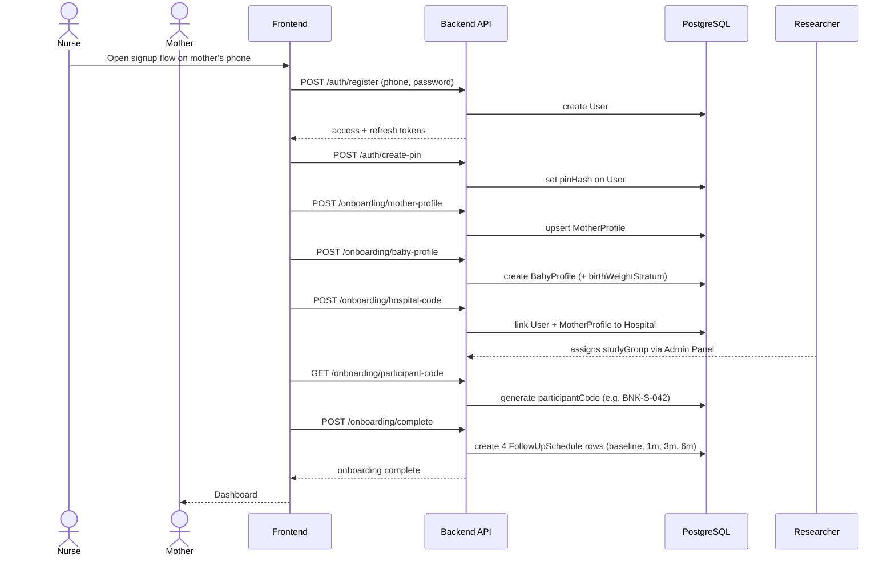
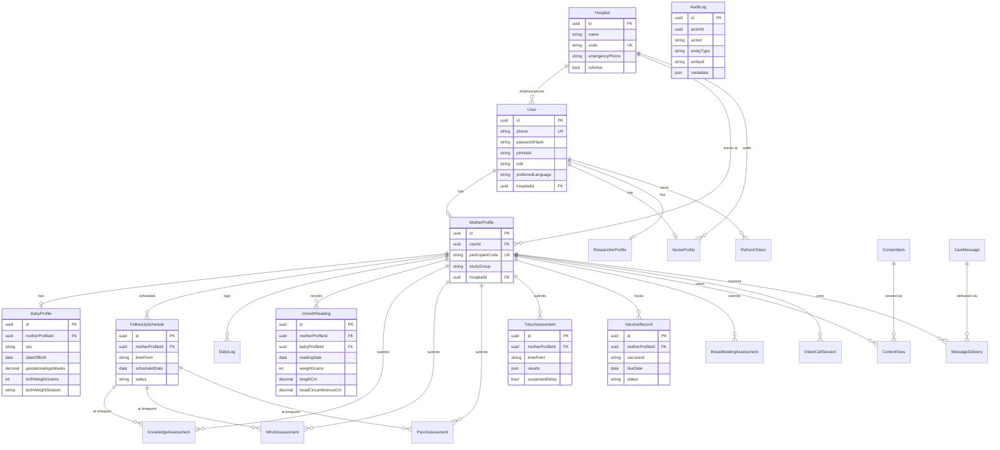
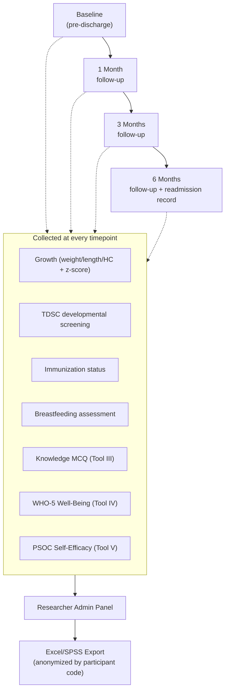

# SnehoAyu (স্নেহ আয়ু)

Preterm Infant Care Companion — mHealth Progressive Web App

SnehoAyu is the intervention arm of a Randomised Controlled Trial evaluating
whether a mobile-based care companion improves clinical outcomes, maternal
knowledge, mental well-being, and self-efficacy among mothers of
NICU-discharged preterm infants in West Bengal. The app serves two roles at
once: a daily care tool for mothers, and a structured data-collection
instrument for the research team.

## Tech Stack

| Layer | Technology |
| --- | --- |
| Frontend | React + TypeScript, Vite, Tailwind CSS, react-router, react-i18next |
| Backend | Node.js + Express + TypeScript (ESM) |
| Database | PostgreSQL via Prisma ORM |
| Auth | JWT access/refresh tokens, bcrypt-hashed 4-digit PIN |
| PWA | vite-plugin-pwa (Workbox), IndexedDB offline queue |
| i18n | Bengali (primary), Hindi, English |

## Repository Layout

```
SnehoAyu2/
├── backend/
│   ├── prisma/             # schema.prisma + migrations
│   └── src/
│       ├── routes/         # Express routers (one per feature)
│       ├── controllers/    # HTTP request/response handling
│       ├── services/       # business logic, DB access
│       ├── content/        # static research-instrument & reference content
│       ├── middlewares/    # auth, error handling, logging
│       └── jobs/           # background schedulers (e.g. daily messages)
├── frontend/
│   └── src/
│       ├── pages/          # route-level screens
│       ├── features/       # per-domain API clients + types
│       ├── components/     # shared/presentational UI
│       └── routes/         # route guards & route table
├── project_plans/          # PRD, roadmap, audit documents
├── USER_GUIDE.md           # how to use & test every feature, by role
└── FEATURES.md             # developer reference: what implements what
```

## Architecture



## User Roles & Use Cases

```mermaid
flowchart TB
    Mother(("Mother /<br/>Caregiver"))
    Nurse(("Hospital<br/>Nurse"))
    Researcher(("Researcher"))

    UC1[["Sign up & onboard<br/>(phone/PIN, profiles, hospital link)"]]
    UC2[["Daily care checklist"]]
    UC3[["Log growth readings"]]
    UC4[["View growth chart & z-score alerts"]]
    UC5[["Complete research assessments<br/>(Knowledge MCQ, WHO-5, PSOC, TDSC, Breastfeeding)"]]
    UC6[["Track immunization schedule"]]
    UC7[["View Danger Signs guide & call hospital"]]
    UC8[["Browse Learning Hub content"]]
    UC9[["Receive daily SMS / weekly audio tips"]]
    UC10[["Join telehealth video call"]]

    UC11[["Enrol new participant"]]
    UC12[["Assign study/control group"]]
    UC13[["View participant list & detail"]]
    UC14[["Export research data (Excel/SPSS)"]]
    UC15[["Manage hospitals"]]
    UC16[["Initiate telehealth call"]]

    Mother --> UC1
    Mother --> UC2
    Mother --> UC3
    Mother --> UC4
    Mother --> UC5
    Mother --> UC6
    Mother --> UC7
    Mother --> UC8
    Mother --> UC9
    Mother --> UC10

    Nurse --> UC1

    Researcher --> UC12
    Researcher --> UC13
    Researcher --> UC14
    Researcher --> UC15
    Researcher --> UC16
    Researcher -.->|"views"| UC11
```



## Onboarding Flow (Sequence)



## Database Entity-Relationship Diagram



## Research Data Collection Flow



## API Surface

| Domain | Base path | Notes |
| --- | --- | --- |
| Health | `/api/health` | DB connectivity check |
| Auth | `/api/auth` | register, login, PIN, refresh, logout |
| Onboarding | `/api/onboarding` | profiles, hospital link, participant code, complete |
| Dashboard | `/api/dashboard` | home summary for mother |
| Checklist | `/api/checklist` | daily care log |
| Growth | `/api/growth` | readings, history, latest, percentile chart |
| Assessments | `/api/assessments` | Knowledge MCQ, WHO-5, PSOC |
| TDSC | `/api/tdsc` | developmental milestone screening |
| Immunization | `/api/immunization` | vaccine schedule + mark-complete |
| Breastfeeding | `/api/breastfeeding` | feeding assessment submission |
| Content | `/api/content` | Learning Hub view tracking |
| Messages | `/api/messages` | daily SMS / weekly audio history |
| Telehealth | `/api/telehealth` | video call session scheduling |
| AI Insights | `/api/insights` | Groq-powered care summary / Q&A, scoped to baby care only |
| Admin | `/api/admin` | researcher-only: participants, study-group, hospitals (incl. per-hospital nurses + participants), export |

All routes except `/api/health` and `/api/auth/*` require a `Bearer` JWT
access token. Admin routes additionally require `role: researcher`.

## Local Development

```bash
# install dependencies (root workspace)
npm install

# backend
cd backend
cp .env.example .env   # then edit DATABASE_URL and JWT_ACCESS_SECRET — see below
npx prisma generate
npx prisma migrate deploy   # applies all committed migrations to your DATABASE_URL
npx prisma db seed          # creates the BNK / BWN test hospitals required for onboarding
npm run dev                  # http://localhost:4000

# frontend
cd frontend
cp .env.example .env   # optional — only needed if your API isn't at localhost:4000/api
npm run dev              # http://localhost:5173
```

### Backend environment variables (`backend/.env`)

| Variable | Required | Notes |
| --- | --- | --- |
| `DATABASE_URL` | Yes | Postgres connection string. Works with local Postgres or a hosted provider (e.g. Neon) — include `?sslmode=require` for hosted Postgres. |
| `JWT_ACCESS_SECRET` | Yes | Generate with `node -e "console.log(require('crypto').randomBytes(64).toString('hex'))"`. Never reuse the placeholder in `.env.example` or commit a real value. |
| `PORT` | No (default `4000`) | |
| `CORS_ORIGINS` | No | Comma-separated allowed frontend origins. |
| `ACCESS_TOKEN_EXPIRES_IN` / `REFRESH_TOKEN_EXPIRES_IN_DAYS` | No | Token lifetimes. |
| `ENABLE_DEV_RANDOM_GROUP_ASSIGNMENT` | No | Dev-only escape hatch that randomly assigns study/control group instead of requiring a researcher to do it. **Never enable in production** — it breaks randomization integrity. |
| `BCRYPT_PASSWORD_ROUNDS` | No (default `12`) | |
| `GROQ_API_KEY` | No — only for AI Care Assistant | Get one at [console.groq.com/keys](https://console.groq.com/keys). Without it, `/api/insights/generate` returns `503 AI_NOT_CONFIGURED`; the rest of the app works normally. |
| `GROQ_MODEL` | No (default `llama-3.3-70b-versatile`) | |

`backend/.env` and `frontend/.env` are git-ignored — only the `.env.example`
templates are committed. Never commit a real `.env`; if a real credential
was ever committed, rotate it immediately (a leaked DB password in git
history is not fixed by deleting the file in a later commit — the old
commit still has it).

### Database setup notes

- `npx prisma migrate deploy` applies all migrations in
  `backend/prisma/migrations/` in filename order. If you ever hand-author a
  migration, double check table names against `schema.prisma` — models
  without an explicit `@@map(...)` use their **PascalCase model name** as
  the table name (e.g. `MotherProfile`, not `mother_profiles`), which is an
  easy mismatch to introduce in raw SQL.
- `npx prisma db seed` (`backend/prisma/seed.ts`) creates 3 test hospitals,
  3 researcher/admin accounts, 9 nurses, and 24 fully-onboarded mother
  participants — see **Test Accounts (Seed Data)** below. It's idempotent
  (uses `upsert`), so re-running it is always safe. Onboarding's
  hospital-code step will fail with `HOSPITAL_CODE_INVALID` until this has
  been run at least once.
- `npx prisma migrate status` tells you whether your database is in sync
  with the committed migrations — run this first whenever you see
  unexplained 500 errors after pulling new backend code.

### Test Accounts (Seed Data)

After running `npx prisma db seed`, every account below uses the password
**`TestPass123`** (set a PIN on first login when prompted).

| Role | Phone(s) | Notes |
| --- | --- | --- |
| Researcher / Admin | `9000000001`, `9000000003`, `9000000004` | Full access — assign study groups, manage hospitals, export data. `9000000001` is the principal investigator account. Lands on `/admin/participants` after login. |
| Nurse | `9000001001` – `9000001009` | 3 per hospital (Bankura, Burdwan, Purulia pilot site). |
| Mother (participant) | `9000002001` – `9000002024` | 8 per hospital, fully onboarded with baby profiles, mixed study/control groups and birth-weight strata, 4 follow-up schedules each (baseline already marked complete). |

Hospitals seeded: `BNK` (Bankura Medical College), `BWN` (Burdwan Medical
College), `DBN` (Deban Mahato Medical College, Purulia — pilot site).

To check the new hospital drill-down: log in as a researcher → Hospital
Management → click any hospital card to expand its nurse roster and a link
to view only that hospital's participants.

## Testing

```bash
cd backend && npx vitest run
cd frontend && npx vitest run
```

Both suites must pass before considering a change complete. See
[USER_GUIDE.md](USER_GUIDE.md) for manual/exploratory testing steps per
feature, including an 8-step end-to-end smoke test.

## Troubleshooting

| Symptom | Likely cause | Fix |
| --- | --- | --- |
| `500` on register/login with a Prisma stack trace in the response | Database missing recent migrations | `cd backend && npx prisma migrate deploy` |
| Hospital code rejected as invalid | Database not seeded | `cd backend && npx prisma db seed` |
| `STUDY_GROUP_REQUIRED` when generating a participant code | Normal — a researcher must assign study/control first | Log in as a researcher, assign the group from `/admin/participants`, retry |
| Frontend shows a generic "Something went wrong" with no detail | Intentional — the backend never sends raw internal error text to the client (security hardening). Check the backend's own console/stderr for the real stack trace. | — |
| `prisma migrate deploy` fails with "relation already exists" mid-migration | A previous failed deploy partially applied DDL | `npx prisma migrate resolve --rolled-back <migration_name>`, manually drop the partially-created tables, then retry `migrate deploy` |

## Further Reading

- [USER_GUIDE.md](USER_GUIDE.md) — how to use and test every feature, by
  role (Mother / Nurse / Researcher)
- [FEATURES.md](FEATURES.md) — feature-by-feature technical reference for
  developers (which files implement what, known gaps)
- [`project_plans/SnehoAyu(mHealth).md`](project_plans/SnehoAyu(mHealth).md)
  — the full Product Requirements Document
- [`project_plans/PROJECT_REMAINING_WORK.md`](project_plans/PROJECT_REMAINING_WORK.md)
  — the original implementation audit
